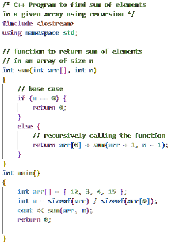
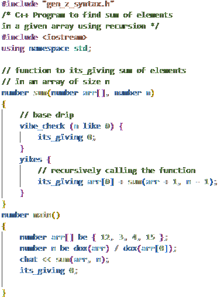
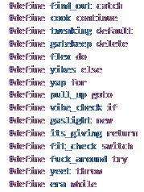
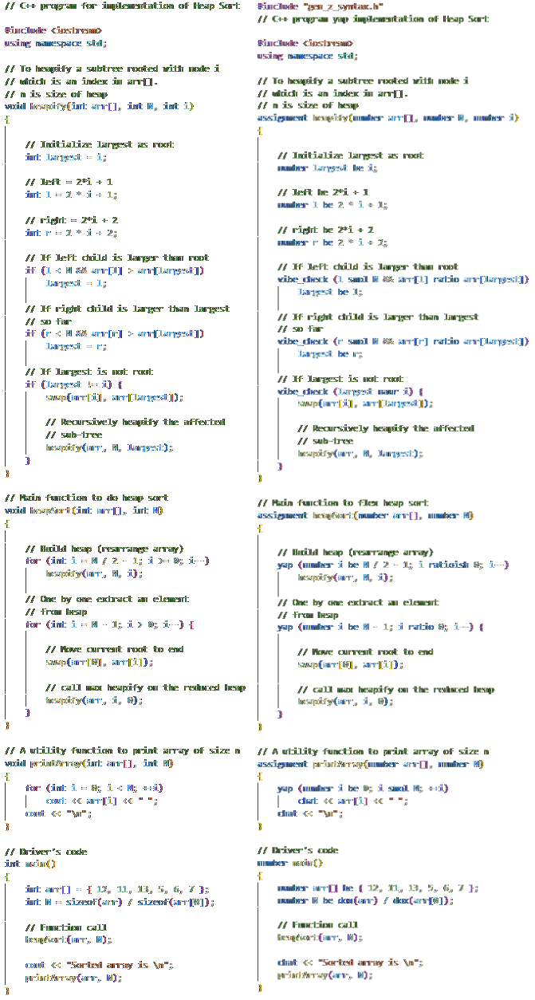

# Gen-Z-Friendly-C-Syntax

In today's world, Gen Z communicates with a dialect of English so strange that it seems foreign to older people. But, similarly, the language of older generations can be hard for Gen Z to understand. C++ is almost 40 years old, and English has changed since then, which is why we are proud to introduce **Gen Z-friendly C++ syntax.**


## before

## after


---

Now Gen Z can program in a way that feels familiar to them using our cutting edge (I made it in an hour) Gen Z-translation macros (define statements)



To use the new syntax, simply put [gen_z_syntax.h](gen_z_syntax.h) in your working directory and copy this line into your C++ file:
```cpp
#include "gen_z_syntax.h"
```
and then use our substitutions for some of C++'s most common keywords!

| C++      | Gen Z |
| -------- | -------       |
| if       | vibe_check    |
| else     | yikes         |
| for      | yap           |
| do       | flex          |
| while    | era           |
| try      | fuck_around   |
| catch    | finc_out      |
| throw    | yeet          |
| switch   | fit_check     |
| case     | drip          |
| class    | lore          |

plus many more.

---

also included is a translator, which takes a cpp file as an input and translates it either to Gen Z syntax or normal C++ syntax. You can use it like this:
```console
./translator.exe [input_file.cpp] [genz/cpp]
```


---

Stop programming like an old person today with Gen Z-Friendly C++

### Credits
#### All code examples used to demo the translator were taken from https://www.geeksforgeeks.org/
- [Array Sum](https://www.geeksforgeeks.org/program-find-sum-elements-given-array/)
- [Heap Sort(https://www.geeksforgeeks.org/heap-sort/)
